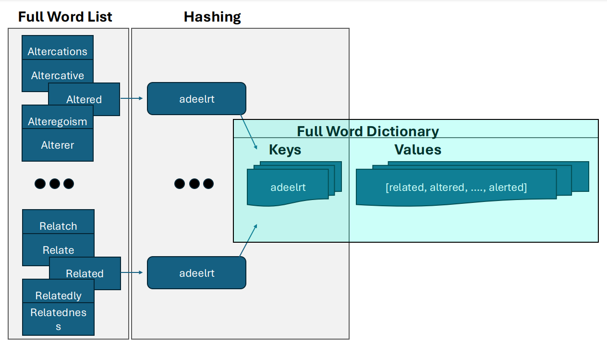
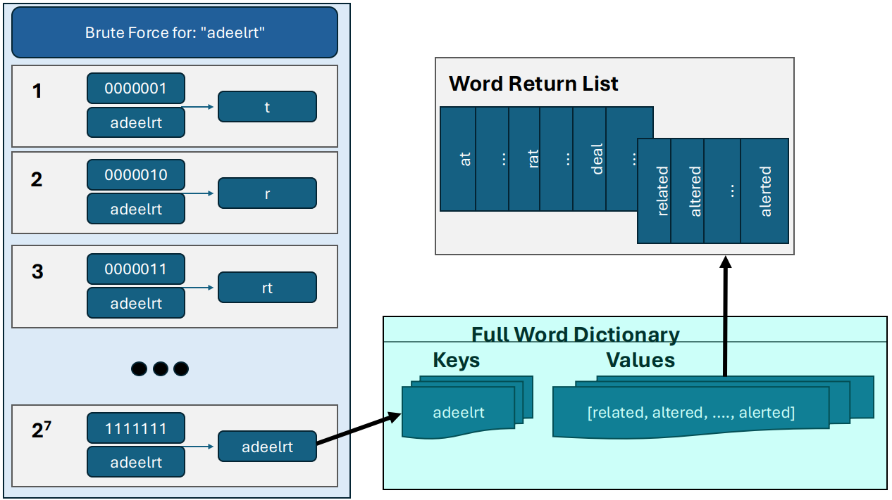
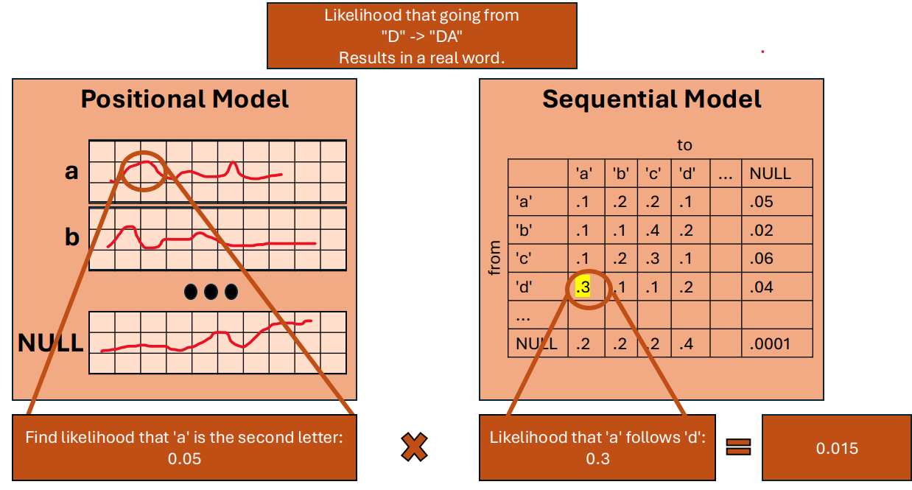
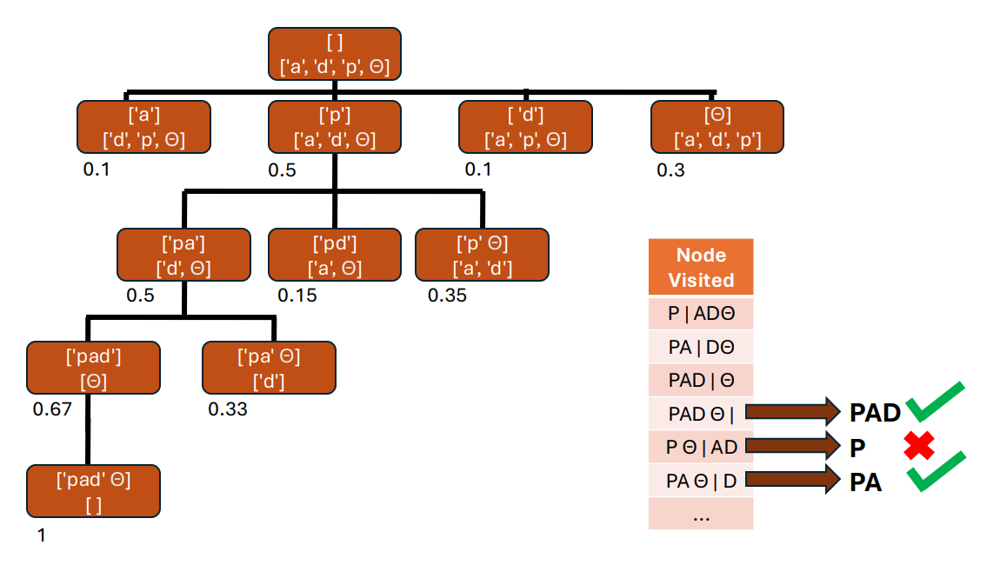

<!-- PROJECT LOGO -->
<br />

# Solving Jumbles with Human Imitating Stochastic Models

  <p align="center">
    This project was created in response to a coding challenge to create an algorithm that can solve a Jumble word puzzle. Two potential solutions have been implemented: the brute force method, and the Human Imitating Stochastic Model (HISM) method. The following documents the theory and complexity analysis of both methods.
  </p>
</div>


<!-- TABLE OF CONTENTS -->
<details>
  <summary>Table of Contents</summary>
  <ol>
    <li>
      <a href="#challenge-prompt">Challenge Prompt</a>
      <ul>
        <li><a href="#assumptions">Assumptions</a></li>
      </ul>
    </li>
    <li>
      <a href="#getting-started">Getting Started</a>
      <ul>
        <li><a href="#prerequisites">Prerequisites</a></li>
        <li><a href="#installation">Installation</a></li>
      </ul>
    </li>
    <li>
      <a href="#usage">Usage</a>
      <ul>
        <li><a href="#examples">Examples</a></li>
      </ul>
    </li>
    <li><a href="#theory">Theory</a></li>
      <ul>
        <li><a href="#brute-force-method">Brute Force Method</a></li>
        <li><a href="#hism-method">HISM Method</a></li>
      </ul>
    <li><a href="#complexity-analysis">Complexity Analysis</a></li>
      <ul>
        <li><a href="#brute-force-complexity">Brute Force Complexity</a></li>
        <li><a href="#hism-complexity">HISM Complexity</a></li>
      </ul>
    <li><a href="#contact">Contact</a></li>
  </ol>
</details>


<!-- ABOUT THE PROJECT -->
## Challenge Prompt

Can you build a jumble solver in Python 3?

You'll have to download a word list, and then take a word as user input (CLI is fine), and finally
return matching “sub-anagrams”. Make sure your program can find words that use a subset of
the provided letters, as well as true anagrams that use every letter.

### Assumptions

1. All we care about is the 26 letters of the English alphabet. All other symbols (numeric and otherwise) may be considered part of the official word, but ignored in the solver. i.e. "12-point" is equivalent to "point" as far as the solver is concerned.

<p align="right">(<a href="#readme-top">back to top</a>)</p>


<!-- GETTING STARTED -->
## Getting Started

To get a local copy up and running follow these simple example steps.

### Prerequisites

No packages needed outside the modules that ship with Python 3. 

### Installation

1. Clone the repo
   ```sh
   git clone https://github.com/stphnpwrs/HISM-Jumble-Solver
   ```
2. Download a word list file containing all possible words you wish to consider. For testing, I used the word list found [here](https://).
3. [OPTIONAL] Download any number of training files containing literature, transcripts, or any desired written media. 
4. Run the command as outlined in <a href="#usage">Usage</a>

<p align="right">(<a href="#readme-top">back to top</a>)</p>


<!-- USAGE EXAMPLES -->
## Usage
   ``` sh
   python3 main.py [-h] word_list_filename jumble_word ...
   ```
The word_list_filename is the path to the file containing all possible words to consider.
The jumble_word is the set of characters you wish to solve.
All arguments after jumble_word are assumed to be paths to files containing plain text to be used in training a HISM.

If only the word_list_filename and jumble_word are present, the Brute Force Method shall be used. However, HISM is used if there are more arguments given.

### Examples

For use of the Brute Force Method, run the following command given the assumption that "./wordlist.txt" is the path to the full list of possible words and "related" is the word Jumble you wish to solve.
   ``` sh
   python3 main.py ./wordlist.txt related
   ```

For use of the HISM Method, run the following command given the assumption that "./training001.txt" and "./training002.txt" are literature used to train the HISM.
   ``` sh
   python3 main.py ./wordlist.txt related ./training001.txt ./training002.txt
   ```

<p align="right">(<a href="#readme-top">back to top</a>)</p>


<!-- THEORY -->
## Theory

The following is a brief overview of the theory behind the Brute Force Method and the HISM Method for solving. This section only covers the high level theory and details of implementation can be found in the code.

### Brute Force Method

A naive approach to solving a word jumble may be to merely try every permutation of the letters in the original set of characters. However, this leads to a large complexity that scales unrealistically with the number of characters in the original set. More specifically, this will have a complexity of O(n!) where n is the number of characters in the original set (ie: the jumble puzzle given).

We can reduce this significantly by reorganizing the list of words to search through so that we do not have to search all permutations but rather different subsets of the letters. In essence, we can use the process shown in the figure below to take every word in the list, organize it so all the letters are arranged in alphabetical order, and then use a dictionary to associate a list of possible words that can be made with the alphabetical hash with the hash itself. In this way, we only have to search through the unique hashes during runtime.

<div align="center">
  <a href="https://github.com/stphnpwrs/HISM-Jumble-Solver">
    
  </a>
</div>

Because we no longer care about the different orderings of the letters and only about the unique alphabetical hashes, we can use binary numbers as masks on the original hash to create every possible ALPHABETICAL combination as shown in the diagram below. Once we have this list, we merely have to use each item as a key and pull all possible words that can be made from that hash from the word list.

<div align="center">
  <a href="https://github.com/stphnpwrs/HISM-Jumble-Solver">
    
  </a>
</div>

### HISM Method

While the previous method is the most efficient way to get a full list of all true anagrams and subanagrams, it is not particularly useful in human prediction. There may be many reasons why we would prefer predictability over accuracy in a model, including the possibility of customizing a particular Jumble puzzle for someone specific. If we can replicate the way a human attempts to solve the Word Jumble, we may be able to reverse engineer the process to aid in the creation of Word Jumbles. 

It's also just really fun.

A Human Imitating Stochastic Model uses two different models to try to build words that best reflect the common rules regarding letters in the English language. For instance, there is little to no use in verifying a set of letters which may contain the pair of letters "qp" in that order as no word in the english language contains that pair in that order.

The first model used is the Positional Model shown in the figure below. The purpose of this model is to give the probability that a letter appears in a specific position in a word. "D" may be more likely to be the first letter of a word rather than "X" for instance. This model is created by iterating through all words in a training file and keeping a cumulative count of how many times each letter appears in each position. We can then normalize these values for each letter.

The second model used is the Sequential Model also shown in the figure below. The purpose of this model is to give the probability that a letter appears after another letter. Similar to the positional model, this model is built by iterating through words in a training file and keeping a cumulative sum of how many times a word is built from one letter to the next. This of course is then normalized as well. It should be noted that a termination character (NULL or theta in the figures) is automatically added to each word as well during the training process, so the probability of the letter being the last letter in the word is also tracked.

<div align="center">
  <a href="https://github.com/stphnpwrs/HISM-Jumble-Solver">
    
  </a>
</div>

Once these models are trained, we can combine these values through multiplication to get a final probability. These final probabilities are used in a greedy search using a priority queue (max heap) to find potential words. An illustration of a greedy search process is shown in the figure below, where the top line in each node is the list of letters making up a word, the bottom row is the list of letters available to use to build upon the word, and the value at the corner of each node is the normalized combined probability from the positional and sequential model.

<div align="center">
  <a href="https://github.com/stphnpwrs/HISM-Jumble-Solver">
    
  </a>
</div>

As is shown in the figure, words are only validated if the word contains the termination character (theta) in the last position when attempting to expand the tree at that node.


<!-- COMPLEXITY ANALYSIS -->
## Complexity Analysis

The following is a complexity analysis on the two methods outlined in the above <a href="#theory">Theory</a> section.

### Brute Force Complexity

Two things must be considered when calculating the complexity of the brute force algorithm: Word List Creation and Runtime.

For word list creation, the complexity for runtime is merely O(k) where k is the number of characters in the word text file. This is because the hashing present here is merely a reorganization of the characters in the word. Since adding values into the dictionary is effectively O(1), forming this new word list structure is an O(k) operation in relation to time. In relation to space, the memory required for the dictionary is more than what is needed for an organized list, but in terms of scalability, the two structures are similar.

For the brute force runtime, the runtime complexity is O(2^n) where n is the number of characters in the Word Jumble. This is shown in the figure presented in the theory where - because we do not care about the order of letters in the word jumble - we iterate from 1 to 2^n and use the binary representation of that number as a mask to get a unique alphabetized subset of the original hash. As using a key in a dictionary has a complexity of O(1), the final runtime for this algorithm - assuming the word list has been created - is O(2^n). 

### HISM Complexity

Similar to the brute force algorithm, we should consider model creation along with runtime when calculating the complexity for the HISM method. 

For model creation for both the sequential and the positional models, the runtime complexity would also be O(k) where k is the number of characters in all the listed training files. As these model creations are not nested, the runtime would effectively be 2*O(k) or just simply O(k).

For runtime of the HISM method, the complexity theoretically gets much worse, as we need to build a tree that (in the worst case scenario) may have every single unique permutation of the letters. This means that the size of the tree is potentially n! where n is the number of letters in the Word Jumble. Since we have to also push and pop elements from a priority queue (which is normally both O(log(v)) operations where v is the number of items in the queue), the worst possible runtime for the HISM algorithm is O(n!*log(n!)). 

It must be noted though, that this is a greedy heuristic, and this runtime in practice can be significantly decreased by adding a probability threshold for the priority queue. This means that any node pairing with a calculated probability below a given threshold is discarded and ignored. This imitates the way humans may see letters such as 'q' and 'p' and never even remotely consider any subset of letters in which 'p' comes directly after 'q'.


<!-- CONTACT -->
## Contact

Stephen Powers - stphnprws@gmail.com

Project Link: [https://github.com/stphnpwrs/HISM-Jumble-Solver](https://github.com/stphnpwrs/HISM-Jumble-Solver)

<p align="right">(<a href="#readme-top">back to top</a>)</p>
